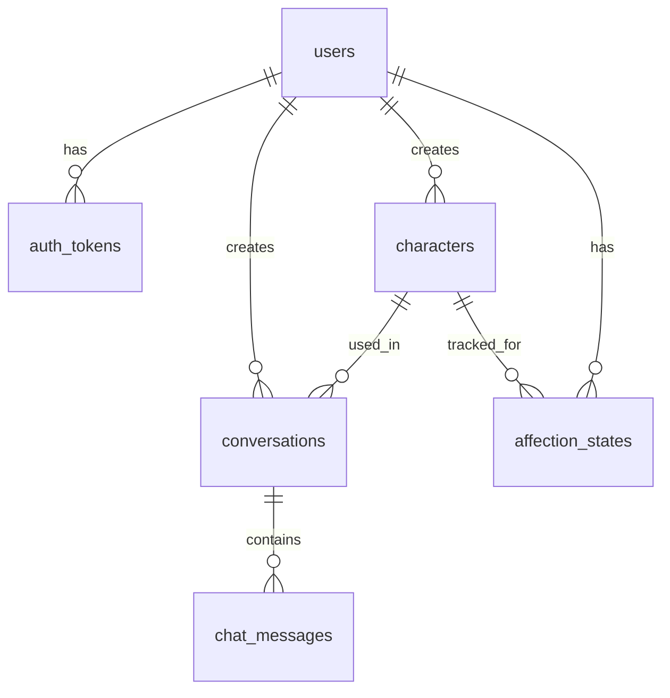

# DokiChat — Database Schema
### Version 1.0 | 28/03/2026 | Neon PostgreSQL + Upstash Redis

---

## Stack

| Component | Provider | Vai trò |
|---|---|---|
| Database | Neon PostgreSQL | Profile, auth, characters, lịch sử |
| Cache | Upstash Redis | Sliding window 50 tin + rate limit |
| Object | Cloudflare R2 | Avatar (zero egress, CDN cache) |

---

## Tables (6)

```
users              → Auth + profile + bio (thay Qdrant memory)
auth_tokens        → Refresh tokens (JWT access không lưu DB)
characters         → Built-in (5) + UGC characters
conversations      → Phiên chat (user × character)
chat_messages      → Lịch sử tin nhắn (batch flush từ Redis)
affection_states   → Thân mật per user × character
```

---

## ERD



---

## Auth Flow

- **Access token**: JWT, 15 phút, verify bằng secret key (KHÔNG lưu DB)
- **Refresh token**: Random string, 30 ngày, hash lưu trong `auth_tokens`
- **Đăng ký**: `POST /auth/register` → bcrypt hash → INSERT users → return JWT
- **Đăng nhập**: `POST /auth/login` → verify bcrypt → return JWT + refresh

---

## Redis Data Structures (Upstash)

```python
# Sliding window (50 tin, TTL 1h)
LPUSH   history:{conv_id}  message_json
LTRIM   history:{conv_id}  0  49
EXPIRE  history:{conv_id}  3600

# Rate limit (30 tin/phút)
ZADD    ratelimit:{user_id}  {now}  {msg_id}
ZREMRANGEBYSCORE  ratelimit:{user_id}  0  {now-60}
ZCARD   ratelimit:{user_id}
EXPIRE  ratelimit:{user_id}  61
```

---

## DDL

See: `scripts/migrations/001_init.sql`
